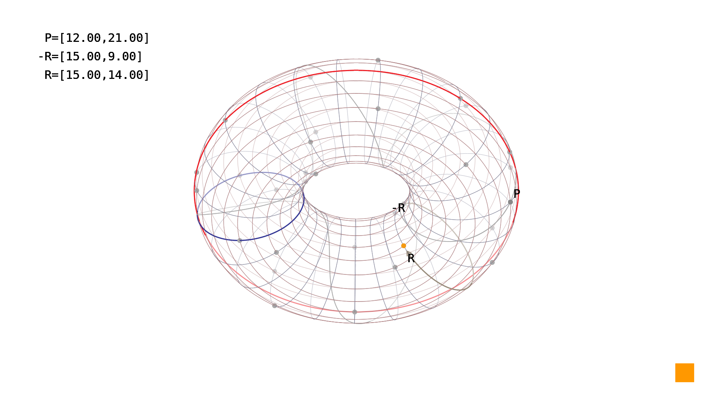

# WTF zk 教程第 30 讲：有限域上的椭圆曲线

继上一讲介绍了实数域上的椭圆曲线后，本讲将深入探讨有限域上的椭圆曲线，它们被直接用于零知识证明算法。

## 1. 有限域上的椭圆曲线

在密码学和零知识证明算法中，我们会使用有限域上的椭圆曲线点群，比如 $F_p$ 上的椭圆曲线 $E(\mathbb{F}_p)$，

在有限域 $\mathbb{F}_p$ 上，椭圆曲线被定义为满足以下方程的点的集合：

$$
y^2 \equiv x^3 + ax + b \mod p
$$

其中，$a, b, x, y \in \mathbb{F}_p$， $p$ 是一个素数。此外，为了确保曲线没有奇点，我们需要判别式 $4a^3 + 27b^2 \not\equiv 0 \mod p$。当然，还要加上无穷远点 $O$。

有限域和实数域上的椭圆曲线方程形式相近，但是由于有限域不是连续的，而是离散的，得到的图形并不是曲线，而是一堆离散的点。举个例子，下面是 $y^2 = x^3 - x + 1 \mod 13$ 得到的椭圆曲线点集如下：


它由19个点组成（18个点和无穷远点 $O$），它们是：

```python
(0, 1)
(0, 12)
(1, 1)
(1, 12)
(3, 5)
(3, 8)
(4, 3)
(4, 10)
(5, 2)
(5, 11)
(6, 4)
(6, 9)
(7, 5)
(7, 8)
(10, 4)
(10, 9)
(12, 1)
(12, 12)
O
```

我们可以用如下的python代码得到它们

```python
import numpy as np

# 定义有限域F_13的椭圆曲线参数
p = 13
a = -1
b = 1

# 定义有限域F_13下的所有点
x = np.arange(p)
y = np.arange(p)

# 穷举椭圆曲线上的点
curve_points = []
for xi in x:
    for yi in y:
        if (yi**2) % p == (xi**3 + a*xi + b) % p:
            print((xi, yi))
            curve_points.append((xi, yi))

# 解压点坐标
curve_points_x, curve_points_y = zip(*curve_points)
```

## 2. 对称性

实数域上的椭圆曲线相对x轴对称，而有限域上的椭圆曲线也有类似的对称性。根据椭圆曲线方程：

$$
y^2 \equiv x^3 + ax + b \mod p
$$

若 $y \equiv k \mod p$ 满足方程，那么 $y \equiv -k \equiv p-k \mod p$ 也满足方程。因此，有限域上的椭圆曲线相对 $y = \frac{p}{2}$ 对称。也就是下图中的红线：


## 3. 加法运算

虽然有限域上的椭圆曲线点集是一堆离散的点，但是它们之间的加法和实数域上的基本一致。根据椭圆曲线 $E(\mathbb{F}_p)$ 上的两点 $P(x_1, y_1)$ 和 $Q(x_2, y_2)$ 位置不同，分4种情况：

**情况1. 点加（point add）：** 如果 $x_1 \neq x_2$，也就是两个点横坐标不同，那么它们的加法规则：画一条直线穿过 $P$ 和 $Q$（两点确定一条直线），但由于模运算，这条直线碰到边界后，会从对面的边界继续延伸，最终和另一点相交 $R(x_3, y_3)$。因此，三点共线，可以用 $P + Q + R$ 表示，因此有 $P + Q = -R$，其中点 $-R$ 坐标为 $(x_3, p-y_3)$。

点加的代数表示和之前在实数域上的类似，$-R = P+Q = (x_3, p - y_3)$ 的坐标为 $(\lambda^2 - x_1 - x_2 \mod p, \lambda(x_1 - x_3) - y_1 \mod p)$，其中 $\lambda = \frac{y_2 - y_1}{x_2 - x_1} \mod p$。


**情况2. 倍点（poind double）：** 如果 $x_1 = x_2$ 且 $y_1 = y_2 \neq = 0$，此时点 P 和 Q 重合， $P + Q = P+P = 2P$。根据实数域椭圆曲线的规则，这里应该做点 $P$ 的切线；但是对于离散的有限域，求切线需要用到代数几何的知识，超纲了（可以用下图感受下）。因此，我们直接用它的代数形式就行，此时 $2P = -R$，坐标为 $(\lambda^2 - 2x_1 \mod p, \lambda(x_1 - x_3) - y_1) \mod p$，其中 $\lambda = \frac{3x_1^2 + a}{2y_1} \mod p$。



**情况3. 逆元相加：** 如果 $x_1 = x_2$ 且 $y_1 = -y_2 = p- y_2 \neq 0$，我们可以写为 $P = -Q$，它们在椭圆曲线点群中互为逆元。这种情况下，画一条直线穿过 $P$ 和 $Q$（两点确定一条直线），该直线垂直于 x 轴，和椭圆曲线相交于无穷远点，也就是 $P + (-P) = O$。

**情况4. 纵坐标为0：** 如果 $x_1 = x_2$ 且 $y_1 =-y_2 = 0$，也就是两点重合且纵坐标为0，此时 $P + Q = O$。

下面举个例子，给定有限域上的椭圆曲线 $y^2 = x^3 - x + 1 \mod 13$，给定两个点 $P(6,4)$ 和 $Q(7,5)$，求 $R'(x_3, y_3) = P+Q$。根据代数形式，先求斜率 $\lambda = \frac{y_2 - y_1}{x_2 - x_1} = \frac{5-4}{7 - 6} = \frac{1}{1} = 1 \mod 13$。然后 $x_3 = \lambda^2 - x_1 - x_2 \mod p = 1 -7-6 = 1 \mod 13$， $y_3 = \lambda(x_1 - x_3) - y_1 = (6-1) - 4 = 1$，因此结果为 $(1,1)$，与图像相符（图中的点 $-R$）。


## 4. 群律

有限域上的椭圆曲线 $E(\mathbb{F}_p)$ 上的点可以构成Abel群，满足5条基本性质：

- **封闭性：** 任意两个群内的点通过定义在椭圆曲线上的加法运算相加，其结果仍然是群内的一个点。
- **存在单位元：** 无穷远点 $O$ 是椭圆曲线群的单位元，对任意群内的点 $P$，有 $P + O = P$。
- **存在逆元：** 对于任意点 $P(x, y)$ 在 $E(\mathbb{F}_p)$ 上，存在一个点 $P'(x, p-y)$ 使得 $P + P' = O$，即 $P'$ 是 $P$ 的逆元，记为 $P' = -P$。
- **结合律：** 对于群内的任意三个点 $P, Q, R$，满足 $(P + Q) + R = P + (Q + R)$。
- **交换律：** 对于群内的任意两个点 $P, Q$，满足 $P + Q = Q + P$。

前三条性质根据定义容易得到，而结合律和交换律可以用加法运算的代数形式证明。

下面给出 有限域上的椭圆曲线 $y^2 = x^3 - x + 1 \mod 13$ 所有点之间的加法运算结果，你可以在上面验证是否符合这5条性质，其中 (inf, inf) 代表无穷远点 $O$：


## 5. 有限性

由于有限域元素是有限且循环的，因此有限域上的椭圆曲线点群中的元素个数也是有限的，这意味着加密算法会在在一个固定大小的集合内进行运算，对于算法的实现至关重要。

那么 $E(\mathbb{F}_p)$ 上究竟包含多少个元素呢？我们可以简单估计一个上限：横坐标 $x$ 共有 $p$ 种可能的取值，而对于每个 $x$，在满足椭圆曲线方程 $y^2 = x^3 + ax + b$ 的条件下，纵坐标 $y$ 最多有两种取值， $y$ 或 $p-y$，再加上无穷远点 $O$，共有 $2p + 1$ 种可能。因此 $E(\mathbb{F}_p)$ 中最多有 $2p + 1$ 个元素。

但是这个估计的上限并不紧致，因为 $x^3 + ax + b$ 可能是模 $p$ 下的二次非剩余，我们需要把这些情况排除掉。大体上有 50% 的概率会发生这种情况，因此 $E(\mathbb{F}_p)$ 大概是 $0.5 * 2p +1 = p + 1$ 个元素。

### 5.1 Hasse定理

Hasse定理给出了有限域上椭圆曲线点数的一个界限，它表明曲线上的点数 $N$ 与有限域的阶 $p$ 之间满足以下不等式：

$$
|N - (p + 1)| \leq 2\sqrt{p}
$$

这意味着椭圆曲线上的点数大致接近 $p$，但会有一个可能的偏差，这个偏差的绝对值不超过 $2\sqrt{p}$。

Hasse定理给出了有限域上椭圆曲线点群的上限和下限，这意味着点群中有足够多的元素，为椭圆曲线上的离散对数问题（ECDLP）的困难性提供了基础，我们会在下一讲讨论它。

另外，你可以通过 [Schoof 算法](https://en.wikipedia.org/wiki/Schoof%27s_algorithm) 精确的求出 $E(\mathbb{F}_p)$ 中的元素个数，算法复杂度为 $O((\log{p})^6)$。

## 6. 总结

这一讲，我们介绍了有限域 $\mathbb{F}_p$ 椭圆曲线 $E(\mathbb{F}_p)$，包括对称性，加法运算，群律，和有限性。有限域上的椭圆曲线为现代密码学和区块链技术提供了强大的数学基础，我们要好好把它搞懂。